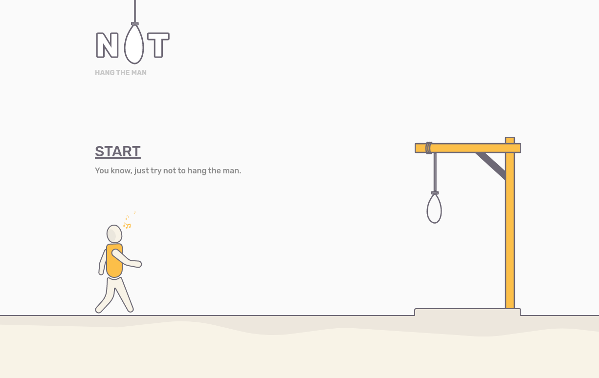

# Patika - Hepsiburada React Bootcamp - Ödev 2

Classic (not) hang man game enhancing route, state, context concepts understanding in React.
<br/>

## Demo

Check [this link](https://odev-2-berkcvlk-pied.vercel.app/) to view demo
<br/><br/>

## Preview


<br/><br/>

## Installation

After clone the project:

```bash
cd patika-hangman-game
yarn && yarn start
```
